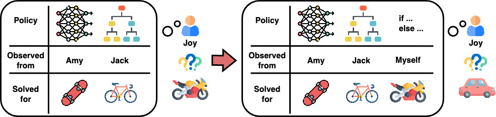

# Knowledge-Grounded RL

Knowledge-grounded reinforcement learning (KGRL) is an RL paradigm that seeks to find an optimal policy given a set of external policies. A well trained KGRL agent is expected to be knowledge-acquirable, sample efficient, generalizable, compositional, and incremental.

The term KGRL is defined in the paper [Flexible Attention-Based Multi-Policy Fusion for Efficient Deep Reinforcement Learning](https://arxiv.org/abs/2210.03729) at NeurIPS 2023. This repo is the official implementation. Our code is based on [rl-starter-files](https://github.com/lcswillems/rl-starter-files), [stable-baselines3](https://github.com/DLR-RM/stable-baselines3), and [rl-baselines3-zoo](https://github.com/DLR-RM/rl-baselines3-zoo).




## Updates
* Dec 10, 2023: released code of training and testing KIAN in MiniGrid and OpenAI-Robotics.
* Oct 10, 2023: initialized this repo with README.

## Getting Start

### Setup for MiniGrid experiments
* Create conda environment
```bash
conda create --name kgrl-minigrid python=3.9
```
* Install [PyTorch](https://pytorch.org/get-started/locally/)
* Install packages
```bash
pip install -r minigrid_requirements.txt
```

### Setup for OpenAI-Robotics experiments
* Create conda environment
```bash
conda create --name kgrl-robotics python=3.9
```
* Install [PyTorch](https://pytorch.org/get-started/locally/)
* Install stable-baselines3 from source
```bash
cd openai-robotics-kgrl/stable-baselines3/
pip install -e .
```
* Install other packages
```bash
cd ../../
pip install -r robotics_requirements.txt
```

## Experiments on MiniGrid

### Train a model in KGRL
An example to train a model under KGRL paradigm in [MiniGrid Environemnts](https://minigrid.farama.org/):
```bash
cd minigrid-kgrl
python -m scripts.train --algo ppo --env [name of the MiniGrid environment] --model [original, kogun, a2t, kian]
```

### Evaluate a model in KGRL
To evaluate a trained agent, run 
```bash
python -m scripts.evaluate --env MiniGrid-DoorKey-5x5-v --model [saved model name]
```
If not specified during training, trained agents are saved in `minigrid-kgrl/storage`. 

### Customize your own model or knowledge set
* New model can be added in the directory `minigrid-kgrl/models`.
* Knowledge set can be added or revised in the file `minigrid-kgrl/models/external_knowledge.py`


## Experiments on OpenAI-Robotics

### Train a model in KGRL
We use RL Baselines3 Zoo as the training framework. For more information about rl-baselines3-zoo, please visit [here](https://github.com/DLR-RM/rl-baselines3-zoo).  

To train an agent with default parameters, run the following commands: 
```bash
cd openai-robotics-kgrl/rl-baselines3-zoo/
python train.py --algo sac --env [name of the Gym environment] --kgrl-algo [RL or KIAN]
```

### Evaluate a model in KGRL
To evaluate a trained agent, run 
```bash
python enjoy.py --algo sac --env [name of the Gym environment] -f [folder where the trained agent is saved]
```
If not specified during training, trained agents are saved in `openai-robotics-kgrl/rl-baselines3-zoo/logs/`. 

### Customize your own model or knowledge set

All functions of external knowledge policies should be implemented inside `openai-robotics-kgrl/stable-baselines3/stable_baselines3/common/env_kg.py`. 
In the same file, you can find an example of our implementation for OpenAI-Robotics Fetch environments. 

The structure of an external knowledge function should be 
```python
import torch as th

def yourGetKGAction(
	obs: th.Tensor, 
	action_dim: int, 
	env_type: str, 
	log_std_min: int, 
	device: th.device, 
): 

	"""
	Get the external knowledge actions for your own environments
	param obs: observations
	param action_dim: dimension of an action
	param env_type: type of the environment 
		(if this function is shared among multiple environments, use this parameter to distinguish them)
	param log_min_stde: min value of log standard deviation (std)
	param device: device where the outputs are stored
	return kg_mean_actions: mean action from the external knowledge policy
	return kg_log_std: log std from the external knowledge policy
	"""
```

To use your customized external knowledge function during training, add the name of this function as an hyperparameter in `openai-robotics-kgrl/rl-baselines3-zoo/hyperparams/sac.yml`. 
Here is an example: 
```yaml
FetchPickAndPlace-v1:
  env_wrapper: sb3_contrib.common.wrappers.TimeFeatureWrapper
  n_timesteps: !!float 1e6
  policy: 'MultiInputPolicy'
  buffer_size: 1000000
  batch_size: 2048
  gamma: 0.95
  learning_rate: !!float 5e-4
  tau: 0.05
  replay_buffer_class: HerReplayBuffer
  replay_buffer_kwargs: "dict(
    online_sampling=True,
    goal_selection_strategy='future',
    n_sampled_goal=4,
  )"
  policy_kwargs: "dict(
    net_arch=[512, 512, 512], 
    n_critics=2, 
    env_type='PickAndPlace', 
    kg_num=2, 
    kg_log_std=-1, 
    kg_emb_dim=4, 
    kg_hid_dim=64, 
    kg_hid_num=2, 
    get_kg_func='fetchGetKGAction', 
  )"
```


## Citation

```
@inproceedings{chiu2023flexible,
  title={Flexible Attention-Based Multi-Policy Fusion for Efficient Deep Reinforcement Learning},
  author={Chiu, Zih-Yun and Tuan, Yi-Lin and Wang, William Yang and Yip, Michael C},
  booktitle={Thirty-seventh Conference on Neural Information Processing Systems},
  year={2023}
}
```
